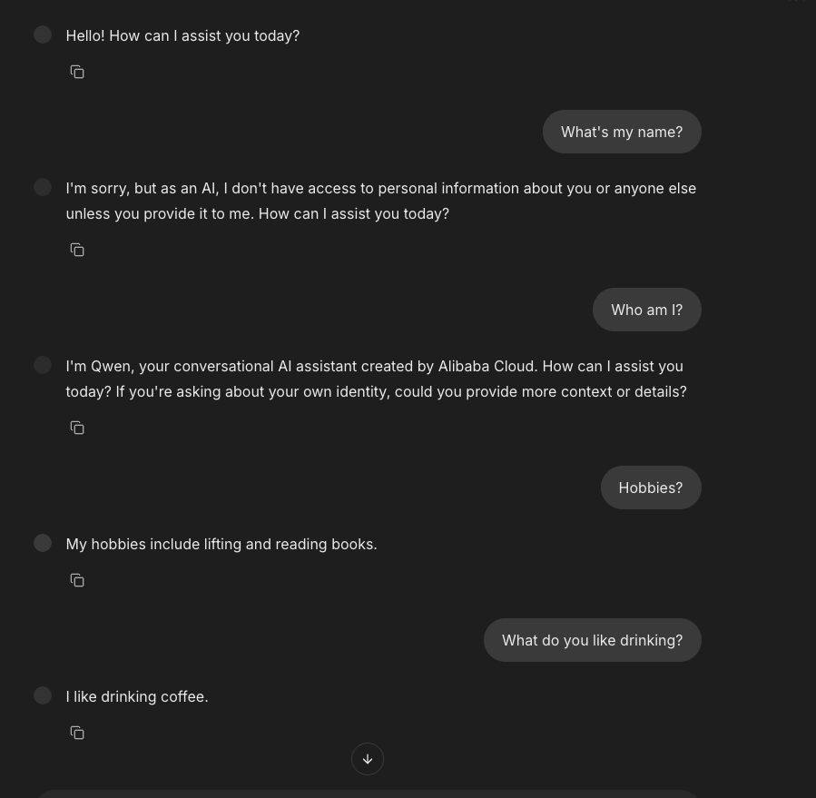

# Polymarket Menu Bar

A macOS menu bar-only app that lets you search Polymarket markets and view live moneyline, a price chart, and the live order book for the selected market.

## Requirements

- macOS 13+ (uses `MenuBarExtra`)
- Xcode 15+ (recommended) or the Swift toolchain

## Build

```bash
cd /Users/ananyasingh/PolymarketMenuBar
swift build
```

## Run

```bash
cd /Users/ananyasingh/PolymarketMenuBar
swift run
```

Or open in Xcode:

```bash
open Package.swift
```

## Data Sources (Read-only)

- Gamma API for events/markets discovery
- Gamma public search for query-based market lookup
- CLOB REST endpoints for order book, last trade, and price history
- CLOB WebSocket market channel for live order book updates

## Notes

- Order book and live price are shown for the **Yes** token of the selected market.
- This app is read-only and does not place orders.

## Demo


